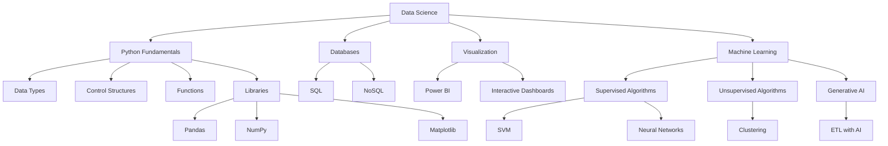

# DIO_Santander_DataScience

<div align="center">
  <h3>Santander Bootcamp 2023 - Data Science with Python</h3>
  <p><i>Materials, exercises, and projects developed during the bootcamp sponsored by Santander in partnership with DIO</i></p>
</div>

<p align="center">
  <a href="#-overview">Overview</a> •
  <a href="#-bootcamp-structure">Structure</a> •
  <a href="#-projects-and-challenges">Projects</a> •
  <a href="#-tools-and-technologies">Tools</a> •
  <a href="#-repository-content">Content</a> •
  <a href="#-license">License</a>
</p>

## 🔍 Overview

This repository documents my learning journey in Data Science through the Santander Bootcamp 2023, including code, practical projects, and study materials. The content reflects the complete bootcamp curriculum, offering a comprehensive view of the skills developed.

<details>
<summary><b>🌟 About the Bootcamp</b> (Click to expand)</summary>

> **Important note**: This bootcamp was originally conducted between August and October 2023, focusing on Data Science with Python.

### Why is this bootcamp important?

1️⃣ **Market-aligned content**
- Modules developed to reflect industry trends and company requirements
- Focus on practical skills valued by employers

2️⃣ **Intensive and comprehensive learning**
- In-depth coverage of Python, Databases, Visualization, and Machine Learning
- Time distribution based on the relevance of topics in today's market

3️⃣ **Practical and targeted learning**
- Coding challenges and projects for immediate application of knowledge
- Updated educational materials with the latest tools and techniques
- Projects that simulate real data scientist challenges
</details>

<details>
<summary><b>⚠️ Note</b> (Click to expand)</summary>

> **Important note**: This bootcamp was originally offered in 2023, but I am completing it in 2025 as part of the benefits of being a Global Student at DIO (Digital Innovation One). The platform allows continuous access to educational content even after the official period ends, enabling students like me to take advantage of the opportunity to develop these skills at a later date.

</details>

## 📚 Bootcamp Structure

<details>
<summary><b>📋 Curriculum Structure</b> (Click to expand)</summary>

### Prepare for the Journey (Onboarding)
- **DIO Bootcamps: Free Education and Employability Together!** (1h)
- **Organizing Your Studies with DIO Roadmaps and Notion** (2h)
- **Code Versioning with Git and GitHub** (2h)
- **Project Challenges: Create a Winning Portfolio** (1h)
- **Contributing to an Open Source Project on GitHub** (1h)
- **Opening Class - Santander Bootcamps 2023** (2h)

### Introduction to Data Science and Python
- **Development Environment and First Steps with Python** (1h)
- **Getting to Know the Python Programming Language** (2h)
- **Types of Operators in Python** (2h)
- **Conditional and Loop Structures in Python** (2h)
- **Manipulating Strings with Python** (2h)
- **Working with Lists in Python** (1h)
- **Getting to Know Tuples in Python** (1h)
- **Exploring Sets in Python** (1h)
- **Learning to Use Dictionaries in Python** (1h)
- **Mastering Python Functions** (1h)
- **Exploring Generative AI in an ETL Pipeline with Python** (2h)

### Solving Your First Code Challenges
- **Code Challenges: Improve Your Logic and Computational Thinking** (1h)
- **Python Challenges: Balancing Balance** (1h)
- **Python Challenges: Organizing Your Assets** (1h)
- **Python Challenges: Conditionally Rich** (1h)
- **Python Challenges: Compound Interest** (1h)
- **Python Challenges: The Big Deposit** (1h)

### First Steps in SQL and NoSQL
- **Introduction to Relational Databases (SQL)** (3h)
- **Introduction to NoSQL Databases** (3h)

### Data Visualization and Analysis with Power BI
- **Business Intelligence (BI) Fundamentals** (2h)
- **Introduction to Data Analysis with SQL** (3h)
- **Theoretical Foundations of ETL** (1h)
- **First Steps with Power BI** (3h)
- **Working with Visuals in Power BI** (4h)
- **BI Fundamentals: KPIs and Metrics** (1h)
- **Creating Interactive Dashboards with Power BI** (2h)
- **Creating a Management Sales Report with Power BI** (1h)
- **Data Collection and Extraction with Power BI** (3h)
- **Data Cleaning and Transformation with Power BI** (2h)
- **Creating a Corporate Dashboard with MySQL and Azure Integration** (1h)

### Machine Learning Fundamentals and Techniques
- **Introduction to Machine Learning** (2h)
- **Bio-inspired Machine Learning Methods** (1h)
- **Artificial Neural Networks** (1h)
- **Genetic Algorithms** (2h)
- **SVM (Support Vector Machine) Algorithms** (1h)
- **Problem Classification: Exploring Datasets** (1h)
- **Programming Languages for Machine Learning** (1h)
- **Python for Machine Learning in Practice** (2h)
- **Evaluate this Bootcamp** (1h)

</details>

<details>
<summary><b>🚀 Mentoring Sessions (Live)</b> (Click to expand)</summary>

### Technical and Career Mentoring
- **Opening Class - Santander Bootcamps 2023** (2h)
- **Intelligent Development: Maximizing Your Productivity with Generative AI** (2h)
- **Demystifying SQL and NoSQL Databases with ChatGPT** (2h)
- **Challenges and Future Perspectives on Generative AI** (2h)
- **Building Your Digital Brand: How to Highlight Your Developer Portfolio** (2h)

</details>

## 📊 Projects and Challenges

<details open>
<summary><b>📋 Project List</b></summary>

<table>
  <tr>
    <th>Project</th>
    <th>Description</th>
    <th>Status</th>
  </tr>
  <tr>
    <td>1. Contributing to an Open Source Project on GitHub</td>
    <td>Contribution to an open source project using GitHub</td>
    <td>🚧 In progress</td>
  </tr>
  <tr>
    <td>2. Exploring Generative AI in an ETL Pipeline with Python</td>
    <td>Development of ETL pipeline with Generative AI</td>
    <td>🚧 In progress</td>
  </tr>
  <tr>
    <td>3. Python Challenges: Balancing Balance</td>
    <td>System for bank balance management</td>
    <td>🚧 In progress</td>
  </tr>
  <tr>
    <td>4. Python Challenges: Organizing Your Assets</td>
    <td>Alphabetical organization of banking assets</td>
    <td>🚧 In progress</td>
  </tr>
  <tr>
    <td>5. Python Challenges: Conditionally Rich</td>
    <td>Withdrawal system with balance verification</td>
    <td>🚧 In progress</td>
  </tr>
  <tr>
    <td>6. Python Challenges: Compound Interest</td>
    <td>Compound interest calculation for investments</td>
    <td>🚧 In progress</td>
  </tr>
  <tr>
    <td>7. Python Challenges: The Big Deposit</td>
    <td>Deposit system with validation</td>
    <td>🚧 In progress</td>
  </tr>
  <tr>
    <td>8. Creating a Management Sales Report with Power BI</td>
    <td>Interactive sales report with Power BI</td>
    <td>🚧 In progress</td>
  </tr>
  <tr>
    <td>9. Creating a Corporate Dashboard with MySQL and Azure Integration</td>
    <td>Dashboard with cloud database integration</td>
    <td>🚧 In progress</td>
  </tr>
</table>
</details>

<details>
<summary><b>1. Contributing to an Open Source Project on GitHub</b></summary>

### Description
The world of Open Source awaits you! In the lab "Contributing to an Open Source Project on GitHub," you'll be introduced to the fascinating universe of open-source collaboration. This practical project was specially designed for technology students like you to dive in and experience firsthand the power of collaborative work and continuous innovation that Open Source provides.

### Objective
Understand and practice the process of contributing to Open Source projects, using GitHub as a collaboration platform.

### What to do?
- Choose an Open Source project to contribute to
- Make a contribution to the project (documentation improvements, feature additions, bug fixes, etc.)
- For first-time contributors, the repository `digitalinnovationone/dio-lab-open-source` is recommended

### Technologies
- GitHub
- Git
- Markdown

### Level
Basic
</details>

<details>
<summary><b>2. Exploring Generative AI in an ETL Pipeline with Python</b></summary>

### Description
Get ready for a practical journey through the world of Data Science! We'll build an ETL (Extract, Transform, Load) pipeline, demonstrating the relationship between data, Artificial Intelligence (AI), and APIs.

- **Extraction**: The adventure begins with a simple spreadsheet, from which we'll extract user IDs. Then, we'll use these IDs to access the 'Santander Dev Week 2023' API and obtain more detailed data.
- **Transformation**: We'll enter the universe of AI with OpenAI's GPT-4, transforming this data into personalized marketing messages.
- **Loading**: We'll finish the process by sending these messages back to the 'Santander Dev Week 2023' API.

### Objective
Reimagine the ETL process by applying the concepts learned in a new application domain.

### Technologies
- Python
- REST
- OpenAI API
- ChatGPT
- ETL

### Level
Advanced
</details>

<details>
<summary><b>3. Python Challenges: Balancing Balance</b></summary>

### Description
You've been hired by a banking company to assist with implementations and improvements to the business system. In an initial analysis, the finance team identified the need to develop a solution that allows customers to balance their bank accounts. The program should request an input representing the employee's current balance, and after that, the value of two transactions should be informed: a deposit and a withdrawal. The program should update the balance based on the transactions and display the final balance.

### Input
- `saldoAtual`: decimal number representing the current bank account balance.
- `valorDeposito`: decimal number representing the amount to be deposited into the account.
- `valorRetirada`: decimal number representing the amount to be withdrawn from the account.

### Output
A decimal number representing the updated balance in the bank account after processing the transactions.

### Technologies
- Python
- Basic Programming Principles

### Level
Basic
</details>

<details>
<summary><b>4. Python Challenges: Organizing Your Assets</b></summary>

### Description
After a careful analysis conducted by the development team of a banking company, the need for a new functionality was identified to optimize processes and improve user experience. Your task is to implement a solution that organizes in alphabetical order a list of assets that will be informed by users. Assets are represented by strings that represent their types, such as: Liquidity reserves, Intangible assets, and others.

### Input
- An integer representing the number of assets the user has.
- Then, the user should provide, on separate lines, the types (strings) of the respective assets.

### Output
The list of Assets organized in alphabetical order, with each asset presented on a separate line.

### Technologies
- Python
- Data Structures
- Sorting

### Level
Basic
</details>

<details>
<summary><b>5. Python Challenges: Conditionally Rich</b></summary>

### Description
A new feature for a banking system was analyzed by the development team and will be one of the tasks to be worked on during the sprint. As a company developer, you received the requirements for the new implementation, which consists of an algorithmic solution that allows customers to make withdrawals at ATMs.

### Withdrawal rules
- Each customer will enter the value of their `saldoTotal` from their bank account and the `valorSaque`.
- A withdrawal can only be made if the available balance in the account is equal to or greater than the requested amount.
- If the balance is sufficient, the requested amount should be subtracted from the available balance, indicating that the withdrawal was made.
- If the balance is insufficient, the withdrawal should not be made, and an appropriate message should be displayed.

### Input
Two integer values representing the total account balance and the withdrawal amount.

### Output
- If the withdrawal is successful: "Saque realizado com sucesso! Novo saldo: {saldo}"
- If the withdrawal is not possible: "Saldo insuficiente. Saque nao realizado!"

### Technologies
- Python
- Conditional Structures

### Level
Basic
</details>

<details>
<summary><b>6. Python Challenges: Compound Interest</b></summary>

### Description
Imagine you're developing an application for a bank that wants to calculate the compound interest on an investment. Your goal is to create a function that takes three parameters: the initial investment value, the annual interest rate, and the time period in years. The function should calculate and return the final investment value after the specified period, taking into account compound interest.

### Input
- `valor_inicial`: integer or decimal number representing the initial investment value.
- `taxa_juros`: decimal number representing the annual interest rate (e.g., 5% = 0.05).
- `periodo`: integer representing the number of years of the investment.

### Output
The final investment value after the specified period, considering compound interest, rounded to two decimal places.

### Technologies
- Python
- Financial Mathematics

### Level
Basic
</details>

<details>
<summary><b>7. Python Challenges: The Big Deposit</b></summary>

### Description
You've been hired by a bank to develop a program that helps its customers make deposits into their accounts. The program should ask the customer for the deposit amount and check if the value is valid. If the value is greater than zero, the program should add the value to the account balance. Otherwise, the program should display an error message. The program should request the deposit amount only once.

### Input
The deposit amount entered by the customer (can be decimal, representing value in reais).

### Output
- If valid value (> 0): "Deposito realizado com sucesso! Saldo atual: R$ {valor}"
- If invalid value (< 0): "Valor invalido! Digite um valor maior que zero."
- If value is 0: "Encerrando o programa..."

### Technologies
- Python
- Conditional Structures

### Level
Basic
</details>

<details>
<summary><b>8. Creating a Management Sales Report with Power BI</b></summary>

### Description
In this project, you will create a report in Power BI Desktop based on the Financials sample provided by Microsoft itself. The necessary data is described in the challenge and on GitHub.

### Objective
Create an elaborate report with:
- Defined structure
- Navigation buttons that provide navigability
- Used slicers and buttons with associated images
- Indicators and buttons to select different visuals on the same subject

### Elements to be created:
- Objects that define the report layout
- Charts (visuals) and the fields that compose them
- Buttons for navigation
- Data slicers
- Second page of the report
- Publication of the report in Power BI Service

### Technologies
- Power BI

### Level
Intermediate
</details>

<details>
<summary><b>9. Creating a Corporate Dashboard with MySQL and Azure Integration</b></summary>

### Description
In this challenge, it will be your turn to apply the steps of collecting, obtaining, and transforming data with Power BI and MySQL in Azure. Follow the steps defined in the videos.

### Objective
Process and transform data using Power BI integrated with MySQL database hosted on Azure.

### Steps:
1. Create a MySQL instance on Azure
2. Explore the resource - MySQL Instance
3. Connect to the Database with Cloud Shell
4. Create Firewall Rule in Azure for Database Access
5. Connect to MySQL on Azure using Workbench
6. Integrate Power BI with MySQL on Azure

### Technologies
- Power BI
- MySQL
- Azure Cloud

### Level
Intermediate
</details>

## 🛠️ Tools and Technologies

<details open>
<summary><b>Technology Stack</b></summary>

- **Python**: Pandas, NumPy, Matplotlib, Scikit-learn
- **Databases**: SQL, NoSQL
- **Power BI**: Visualization and dashboards
- **Git and GitHub**: Versioning and collaboration
- **Machine Learning**: Supervised and unsupervised models
- **Generative AI**: Practical applications in data pipelines
</details>

<details>
<summary><b>Technology Diagram</b> (Click to expand)</summary>


</details>

## 📝 Repository Content

<details open>
<summary><b>Directory Structure</b></summary>

```
DIO_Santander_DataScience/
├── Module_1-Onboarding/
│   ├── Git_GitHub/
│   └── Project_OpenSource/
├── Module_2-Python_DataScience/
│   ├── Python_Fundamentals/
│   ├── Data_Structures/
│   └── Project_ETL_AI/
├── Module_3-Code_Challenges/
│   ├── Challenge_BalancingBalance/
│   ├── Challenge_OrganizingAssets/
│   ├── Challenge_ConditionallyRich/
│   ├── Challenge_CompoundInterest/
│   └── Challenge_BigDeposit/
├── Module_4-SQL_NoSQL/
│   ├── SQL_Fundamentals/
│   └── NoSQL_Introduction/
├── Module_5-PowerBI/
│   ├── BI_Fundamentals/
│   ├── Interactive_Dashboards/
│   └── Project_Sales_Dashboard/
├── Module_6-MachineLearning/
│   ├── ML_Introduction/
│   ├── Supervised_Algorithms/
│   └── Unsupervised_Algorithms/
├── .gitignore
├── LICENSE.md
└── README.md
```
</details>

## 🔄 Updates

This repository is regularly updated with new materials and projects as I progress through the bootcamp, reflecting the progress and skills acquired.

<details>
<summary><b>📋 Update Log</b> (Click to expand)</summary>
  
- **March/2025**: Bootcamp start and repository setup
</details>

## 📜 License

<details open>
<summary><b>CC BY-NC-ND 4.0 License</b></summary>

This repository is licensed under the [Creative Commons Attribution-NonCommercial-NoDerivatives 4.0 International License](https://creativecommons.org/licenses/by-nc-nd/4.0/).

### What this means:

- ✅ **You can share** — You are free to copy and redistribute the material in any medium or format
- ❌ **No commercial use** — You may not use the material for commercial purposes
- ❌ **No derivatives** — You may not remix, transform, or build upon the material
- ✅ **Attribution required** — You must give appropriate credit, provide a link to the license, and indicate if changes were made

For the complete license terms, please see the [LICENSE.md](LICENSE.md) file.
</details>

## 📫 Contact

For questions or suggestions about this repository, contact me through GitHub.

---

<div align="center">
  <p><b>Note</b>: This repository contains study materials from the Santander Bootcamp 2023 - Data Science with Python and serves as a portfolio for learning and developing skills in the field.</p>
</div>
